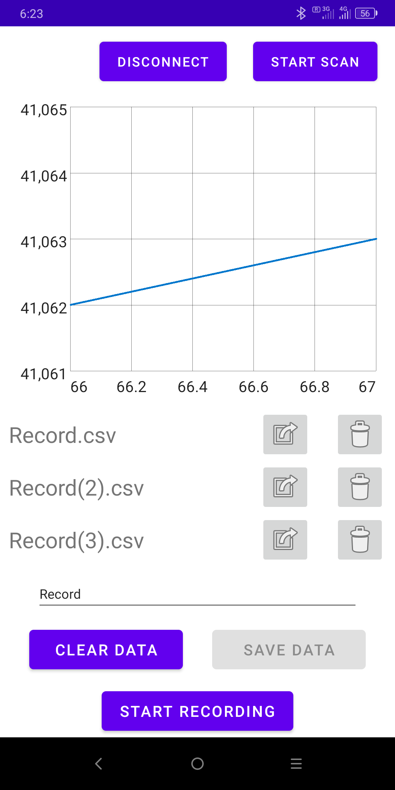

# Seed interval monitoring App

## Usage

This app used for performing seed monitorign laboratory experiments as well as in field metering device seed monitoring.

## Description

This app displays seed interval data received fromm seed monitoring sensor. Bluetooth LE notification subscriition to the following sensor characteristic is implemented: 
```kt
private val THE_DEVICE_NAME: String = "SeedMonitoring"
private val meteringServiceUuid: UUID = UUID.fromString("00009951-0000-1000-8000-00805f9b34fb")

private val seedIntervalUuid: UUID = UUID.fromString("00001B01-0000-1000-8000-00805f9b34fb")
private val seedIntervalDescUuid: UUID = UUID.fromString("00002902-0000-1000-8000-00805f9b34fb")
```

Data can be recorded and saved to the .csv file. The files are stored on the exterla storage in `seedIntervals/records` folder. They also can be shared or deleted via menu.



## Notes

Seed monitorinc sensor device was described in more detail in upcomming scientific article `Rapid plane laser scanning seed monitoring sensor for IoT applications`

An example of the release .apk file is can be found [here](seed_interval_monitoring.apk)

